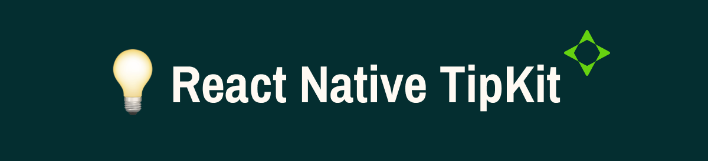

A powerful and flexible React Native library for adding beautiful, customizable tips and tutorials to your app. Inspired by Apple's TipKit, this library provides an easy way to guide users through your app's features.

## Features

- 🎯 Two types of tips: Inline and PopOver
- 🎨 Fully customizable styling
- 📱 Works on iOS and Android
- 🔄 Animated transitions
- 📊 Display count management
- ⚡ Rule-based tip display
- 🎯 Target-based positioning for PopOver tips
- 🔍 Action button support
- 💾 Persistent state management

## Installation

```bash
npm install @travelpass/react-native-tipkit
# or
yarn add @travelpass/react-native-tipkit
```

### Dependencies

This library requires the following dependencies:

```bash
npm install react-native-mmkv react-native-reanimated
# or
yarn add react-native-mmkv react-native-reanimated
```

## Usage

### 1. Wrap your app with TipKitProvider

```jsx
import { TipKitProvider } from '@travelpass/react-native-tipkit';

export default function App() {
  return <TipKitProvider>{/* Your app content */}</TipKitProvider>;
}
```

### 2. Add Inline Tips

Inline tips are perfect for providing context within your UI:

```jsx
import { TipKitInlineView } from '@travelpass/react-native-tipkit';

<TipKitInlineView
  id="feature-tip"
  title="Quick Tip"
  description="Here's how to use this feature"
  tipContainerStyle={styles.tipStyle}
  options={{
    maxDisplayCount: 3,
  }}
/>;
```

### 3. Add PopOver Tips

PopOver tips are great for pointing out specific UI elements:

```jsx
import { TipKitPopOverView } from '@travelpass/react-native-tipkit';

const MyComponent = () => {
  const buttonRef = useRef(null);

  return (
    <>
      <Pressable ref={buttonRef}>
        <Text>Target Button</Text>
      </Pressable>

      <TipKitPopOverView
        id="button-tip"
        targetRef={buttonRef}
        title="Important Action"
        description="Tap this button to perform an action"
        icon={<YourIcon />}
        actionButtonTitle="Learn More"
        actionButtonOnPress={() => {
          // Handle action button press
        }}
        options={{
          maxDisplayCount: 2,
        }}
      />
    </>
  );
};
```

> ⚠️ **Important:** Always place `TipKitPopOverView` components at the root level of your app, outside of components like `SafeAreaView`, `ScrollView`, or any other wrapper that might affect positioning. This ensures proper positioning and visibility of the popover tips.

### 4. Add Conditional Rules

You can control when tips are displayed using rules:

```jsx
<TipKitPopOverView
  id="conditional-tip"
  targetRef={buttonRef}
  title="New Feature"
  description="Try out this new feature"
  options={{
    maxDisplayCount: 4,
  }}
  rule={{
    ruleName: 'showNewFeature',
    evaluate: () => {
      // Return true/false based on your condition
      return someCondition;
    },
  }}
/>
```

## API Reference

### TipKitProvider

The root component that manages the state of all tips.

### TipKitInlineView Props

| Prop              | Type          | Description                         |
| ----------------- | ------------- | ----------------------------------- |
| id                | string        | Unique identifier for the tip       |
| title             | string        | Title of the tip                    |
| description       | string        | Description text                    |
| tipContainerStyle | ViewStyle     | Custom styles for the tip container |
| titleStyle        | TextStyle     | Custom styles for the title         |
| descriptionStyle  | TextStyle     | Custom styles for the description   |
| options           | TipKitOptions | Configuration options               |

### TipKitPopOverView Props

Includes all TipKitInlineView props plus:

| Prop                | Type            | Description                         |
| ------------------- | --------------- | ----------------------------------- |
| targetRef           | RefObject<View> | Reference to the target element     |
| icon                | ReactNode       | Optional icon component             |
| actionButtonTitle   | string          | Text for the action button          |
| actionButtonOnPress | () => void      | Action button callback              |
| actionButtonStyle   | TextStyle       | Custom styles for the action button |
| rule                | TipKitRule      | Optional display rule               |

### TipKitOptions

| Option          | Type   | Description                             |
| --------------- | ------ | --------------------------------------- |
| maxDisplayCount | number | Maximum number of times to show the tip |

### TipKitRule

| Property | Type          | Description                                     |
| -------- | ------------- | ----------------------------------------------- |
| ruleName | string        | Identifier for the rule                         |
| evaluate | () => boolean | Function that determines if tip should be shown |

## Contributing

See the [contributing guide](CONTRIBUTING.md) to learn how to contribute to the repository and the development workflow.

## License

MIT
